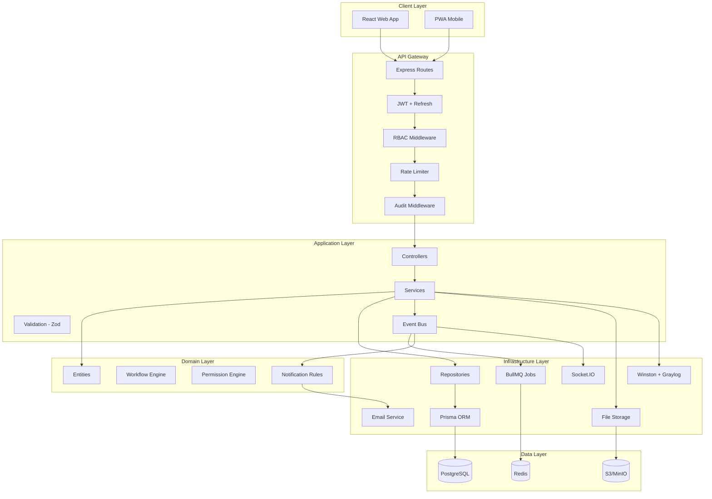

# System Architecture

## Overview

Htask is a modular, event-driven enterprise task and workflow management platform built on Clean Architecture principles with clear separation of concerns across presentation, application, domain, and infrastructure layers.

## Architectural Principles

1. **Domain-Driven Design** — Core business logic isolated in domain layer
2. **CQRS-lite** — Read-optimized queries separate from write commands where beneficial
3. **Event Sourcing (Audit)** — All mutations emit domain events captured in audit log
4. **Soft Delete Everywhere** — No hard deletes; `deletedAt` timestamp on all entities
5. **Configurable Workflows** — State machine transitions stored in database, not code
6. **Multi-tenancy Ready** — Organization-scoped data with row-level isolation

## Layer Diagram



## Component Responsibilities

### Frontend (Feature-Based Architecture)

| Layer | Responsibility |
|-------|----------------|
| `app/` | App shell, providers, routing, theme |
| `pages/` | Route-level page compositions |
| `features/` | Feature modules (tasks, projects, reports) |
| `entities/` | Domain entity UI components |
| `widgets/` | Composite UI blocks (dashboards, timelines) |
| `shared/` | Reusable UI primitives (shadcn/ui) |
| `services/` | API client, WebSocket service |
| `store/` | Zustand global state |
| `hooks/` | Custom React hooks |
| `lib/` | Utilities, constants, formatters |

### Backend (Clean Architecture)

| Layer | Responsibility |
|-------|----------------|
| `routes/` | HTTP route definitions, OpenAPI tags |
| `controllers/` | Request/response handling, status codes |
| `services/` | Business logic orchestration |
| `repositories/` | Data access abstraction |
| `domain/` | Entities, value objects, workflow rules |
| `middleware/` | Auth, RBAC, audit, validation, error handling |
| `events/` | Domain event definitions and handlers |
| `jobs/` | Background job processors (BullMQ) |
| `prisma/` | Database schema and migrations |

## Communication Patterns

### Synchronous (REST)
- CRUD operations on entities
- Search and filtering
- Report generation requests

### Asynchronous (Events + Queue)
- Email notifications
- PDF/Excel report generation
- Bulk exports
- Audit log persistence (decoupled)
- File processing

### Real-time (WebSocket)
- In-app notifications
- Dashboard live updates
- Task status changes
- Active user presence

## Security Architecture

```
Request → Helmet → CORS → Rate Limit → CSRF → JWT Verify → RBAC Check → Input Validation → Handler
                                                                                              ↓
                                                                                        Audit Log
```

- **Authentication**: JWT access tokens (15min) + refresh tokens (7d, rotated)
- **Authorization**: Role-based + resource-level permissions
- **Input Validation**: Zod schemas on both client and server
- **Rate Limiting**: Redis-backed, per-IP and per-user
- **CSRF**: Double-submit cookie pattern for state-changing requests
- **Headers**: Helmet with strict CSP, HSTS, X-Frame-Options

## Scalability Strategy

| Concern | Current | Scale Path |
|---------|---------|------------|
| API | Single Express instance | Horizontal scaling behind load balancer |
| Database | Single PostgreSQL | Read replicas, connection pooling (PgBouncer) |
| Cache | Redis single node | Redis Cluster |
| Queue | BullMQ single worker | Multiple worker processes |
| Files | Configurable storage | CDN for static assets |
| Search | PostgreSQL full-text | Elasticsearch migration path |
| WebSocket | Single Socket.IO | Redis adapter for multi-instance |

## Folder Structure

```
apps/
├── api/
│   └── src/
│       ├── config/
│       ├── controllers/
│       ├── domain/
│       │   ├── entities/
│       │   ├── enums/
│       │   └── workflow/
│       ├── events/
│       │   ├── handlers/
│       │   └── types/
│       ├── jobs/
│       │   ├── processors/
│       │   └── queues/
│       ├── middleware/
│       ├── repositories/
│       ├── routes/
│       ├── services/
│       │   ├── audit/
│       │   ├── auth/
│       │   ├── notification/
│       │   ├── report/
│       │   ├── storage/
│       │   └── workflow/
│       ├── types/
│       ├── utils/
│       ├── app.ts
│       └── server.ts
└── web/
    └── src/
        ├── app/
        ├── entities/
        ├── features/
        │   ├── auth/
        │   ├── projects/
        │   ├── tasks/
        │   ├── worklog/
        │   ├── reports/
        │   ├── audit/
        │   ├── notifications/
        │   └── search/
        ├── hooks/
        ├── lib/
        ├── pages/
        ├── services/
        ├── shared/
        │   ├── components/
        │   ├── layouts/
        │   └── ui/
        ├── store/
        ├── types/
        └── widgets/
```
