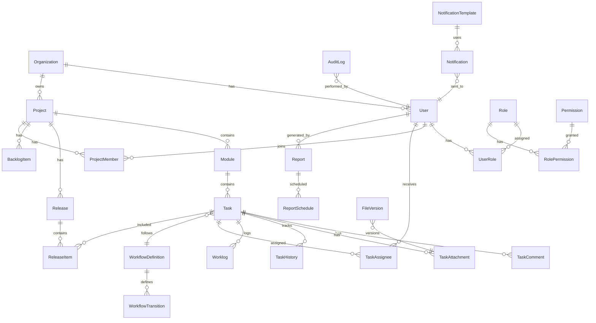

# Database Design

## Entity Relationship Diagram



## Core Tables

### Identity & Access

| Table | Purpose |
|-------|---------|
| `organizations` | Multi-tenant root entity |
| `users` | User accounts with soft delete |
| `roles` | Manager, TeamLead, TeamMember, PMO, QA |
| `permissions` | Granular permission definitions |
| `role_permissions` | Role-to-permission mapping |
| `user_roles` | User-to-role assignment (org-scoped) |
| `refresh_tokens` | JWT refresh token storage |
| `sessions` | Active session tracking |

### Project Hierarchy

| Table | Purpose |
|-------|---------|
| `projects` | Top-level project container |
| `modules` | Project modules (Features, Enhancements, etc.) |
| `project_members` | Team membership with role |
| `releases` | Version releases (semver) |
| `release_items` | Tasks linked to releases |
| `backlog_items` | Backlog with prioritization |

### Task Management

| Table | Purpose |
|-------|---------|
| `tasks` | Core task entity with workflow state |
| `task_types` | Feature, Enhancement, BugFix, Support |
| `task_assignees` | Multi-assignee support |
| `task_comments` | Threaded comments |
| `task_attachments` | File references |
| `file_versions` | Attachment versioning |
| `task_dependencies` | Task blocking relationships |
| `task_labels` | Custom labels/tags |
| `story_points` | Estimation tracking |

### Workflow Engine

| Table | Purpose |
|-------|---------|
| `workflow_definitions` | Per-project or global workflows |
| `workflow_states` | Configurable states (Draft, Open, etc.) |
| `workflow_transitions` | Allowed state transitions with rules |
| `workflow_transition_roles` | Role restrictions per transition |

### Worklog & Time Tracking

| Table | Purpose |
|-------|---------|
| `worklogs` | Time entries (start/pause/resume/stop) |
| `worklog_sessions` | Individual work sessions |
| `utilization_snapshots` | Daily utilization calculations |

### Audit & History

| Table | Purpose |
|-------|---------|
| `audit_logs` | Immutable audit trail |
| `entity_histories` | Polymorphic history (project/module/task) |
| `user_activity_logs` | User-specific activity timeline |

### Notifications

| Table | Purpose |
|-------|---------|
| `notification_templates` | Configurable email/in-app templates |
| `notifications` | Notification instances |
| `notification_preferences` | User channel preferences |

### Reporting

| Table | Purpose |
|-------|---------|
| `reports` | Generated report metadata |
| `report_schedules` | Cron-based report scheduling |
| `report_templates` | Report layout definitions |

### Search

| Table | Purpose |
|-------|---------|
| `search_index` | Denormalized search documents (PostgreSQL tsvector) |

## Indexing Strategy

```sql
-- Performance-critical indexes
CREATE INDEX idx_tasks_project_status ON tasks(project_id, status) WHERE deleted_at IS NULL;
CREATE INDEX idx_tasks_assignee ON task_assignees(user_id) WHERE deleted_at IS NULL;
CREATE INDEX idx_audit_logs_entity ON audit_logs(entity_type, entity_id, created_at DESC);
CREATE INDEX idx_worklogs_user_date ON worklogs(user_id, started_at);
CREATE INDEX idx_notifications_user_unread ON notifications(user_id, read_at) WHERE read_at IS NULL;
CREATE INDEX idx_search_index_fts ON search_index USING GIN(search_vector);
```

## Soft Delete Pattern

Every entity table includes:
- `created_at TIMESTAMPTZ NOT NULL DEFAULT NOW()`
- `updated_at TIMESTAMPTZ NOT NULL DEFAULT NOW()`
- `deleted_at TIMESTAMPTZ NULL` — NULL means active
- `deleted_by UUID NULL` — References user who deleted

Prisma middleware automatically filters `deletedAt: null` on all queries unless explicitly overridden.

## Data Retention

| Data Type | Retention | Archive Strategy |
|-----------|-----------|------------------|
| Audit logs | Indefinite | Partition by month |
| Task history | Indefinite | Linked to soft-deleted tasks |
| Worklogs | Indefinite | Aggregated into utilization snapshots |
| Notifications | 90 days read / 365 days unread | Background cleanup job |
| Reports | 1 year | Move to cold storage (S3) |
| Sessions | 30 days inactive | Auto-expire |

## Migration Strategy

- Prisma Migrate for schema versioning
- Seed scripts for roles, permissions, workflow defaults
- Blue-green deployment compatible (backward-compatible migrations only)
