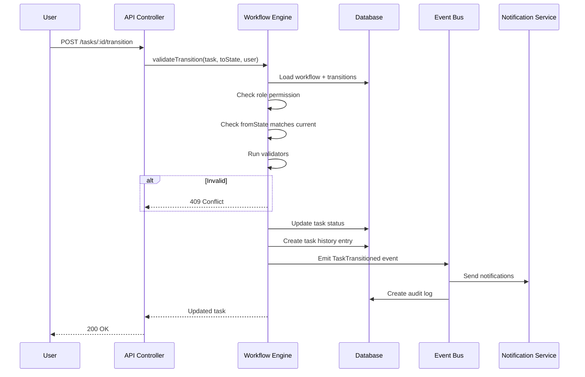

# Workflow Engine Design

## Overview

The workflow engine implements a configurable finite state machine (FSM) where task lifecycle transitions are defined in the database, not hardcoded. Each project can optionally override the default workflow.

## Default Task States

```
DRAFT → OPEN → ASSIGNED → IN_PROGRESS → BLOCKED
                                              ↓
                                    DEVELOPMENT_COMPLETE
                                              ↓
                                        MR_RAISED → MR_APPROVED
                                              ↓
                                    MOVED_TO_STAGE → STAGE_VERIFIED
                                              ↓
                                        MOVED_TO_QA → QA_TESTING
                                                          ↓
                                              QA_FAILED ← → QA_PASSED
                                                              ↓
                                            READY_FOR_PRODUCTION
                                                              ↓
                                                        DEPLOYED → CLOSED → ARCHIVED
```

## State Categories

| Category | States | Color |
|----------|--------|-------|
| Initial | DRAFT | Gray |
| Active | OPEN, ASSIGNED, IN_PROGRESS | Blue |
| Blocked | BLOCKED | Red |
| Development | DEVELOPMENT_COMPLETE, MR_RAISED, MR_APPROVED | Purple |
| Staging | MOVED_TO_STAGE, STAGE_VERIFIED | Orange |
| QA | MOVED_TO_QA, QA_TESTING, QA_FAILED, QA_PASSED | Yellow/Green |
| Release | READY_FOR_PRODUCTION, DEPLOYED | Teal |
| Terminal | CLOSED, ARCHIVED | Gray |

## Transition Rules

Each transition defines:

```typescript
interface WorkflowTransition {
  id: string;
  workflowId: string;
  fromState: TaskState;
  toState: TaskState;
  name: string;                    // "Start Development"
  requiredRoles: Role[];           // Roles allowed to trigger
  requiredFields?: string[];       // Fields that must be set
  validators?: TransitionValidator[]; // Custom validation rules
  sideEffects?: SideEffect[];      // Auto-actions on transition
  requiresApproval: boolean;       // Needs TL/Manager approval
  notifyRoles?: Role[];            // Who to notify
}
```

## Transition Execution Flow



## Configurable Aspects

1. **Per-Project Workflows** — Projects can select or customize workflow definitions
2. **Transition Guards** — JavaScript expression validators (sandboxed)
3. **Auto-Transitions** — Time-based or event-based automatic transitions
4. **Parallel States** — Support for sub-statuses (e.g., IN_PROGRESS + code review)
5. **Approval Gates** — Transitions requiring manager/TL sign-off

## Side Effects

| Effect | Trigger | Action |
|--------|---------|--------|
| Auto-assign | ASSIGNED | Set assignee from transition metadata |
| Notify QA | MOVED_TO_QA | Notify all QA team members |
| Start Timer | IN_PROGRESS | Create worklog session |
| Stop Timer | DEVELOPMENT_COMPLETE | Finalize active worklog |
| Create Defect | QA_FAILED | Auto-create linked bug task |
| Update Release | DEPLOYED | Mark release item as deployed |

## Backlog Workflow (Separate FSM)

```
IDEA → BACKLOG → PLANNED → SPRINT → DEVELOPMENT → QA → RELEASE
```

Backlog items promote to tasks when entering SPRINT state.

## API Integration

```typescript
// Get available transitions for current user
GET /tasks/:id/transitions
→ [{ toState: "IN_PROGRESS", name: "Start Work", requiresApproval: false }]

// Execute transition
POST /tasks/:id/transition
{ toState: "IN_PROGRESS", comment: "Starting development" }
```

## Audit Integration

Every transition creates:
1. `TaskHistory` entry with old/new state
2. `AuditLog` entry with full context
3. `EntityHistory` polymorphic record

## Frontend Integration

- Kanban board columns map to workflow state categories
- Transition buttons shown based on available transitions for current user
- Drag-and-drop between columns triggers transition API
- Transition modal for required comments/fields
