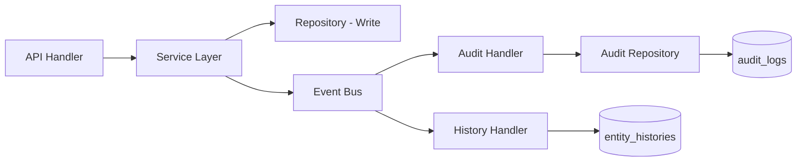

# Audit Architecture

## Design Principles

1. **Immutable** — Audit logs are append-only, never modified or deleted
2. **Comprehensive** — Every mutation and security event is captured
3. **Contextual** — Full before/after state with request metadata
4. **Queryable** — Fast filtering by entity, user, action, date range
5. **Decoupled** — Audit writes happen asynchronously via event bus

## Audit Log Schema

```typescript
interface AuditLog {
  id: string;
  organizationId: string;
  userId: string | null;          // null for system actions
  action: AuditAction;            // TASK_CREATED, USER_LOGIN, etc.
  entityType: string;             // task, project, user, etc.
  entityId: string;
  oldValue: Json | null;          // Previous state (partial)
  newValue: Json | null;          // New state (partial)
  metadata: {
    ip: string;
    userAgent: string;
    browser: string;
    device: string;
    os: string;
    requestId: string;
    sessionId: string;
  };
  createdAt: Date;
}
```

## Captured Actions

### Authentication
- `USER_LOGIN`, `USER_LOGOUT`, `USER_LOGIN_FAILED`
- `TOKEN_REFRESHED`, `PASSWORD_CHANGED`
- `SESSION_EXPIRED`

### Entity CRUD
- `{ENTITY}_CREATED`, `{ENTITY}_UPDATED`, `{ENTITY}_DELETED`
- Entities: PROJECT, MODULE, TASK, RELEASE, BACKLOG, USER, ROLE

### Workflow
- `TASK_TRANSITIONED`, `WORKFLOW_APPROVED`, `WORKFLOW_REJECTED`

### Collaboration
- `COMMENT_ADDED`, `COMMENT_UPDATED`, `COMMENT_DELETED`
- `FILE_UPLOADED`, `FILE_DELETED`, `FILE_VERSIONED`

### Administration
- `ROLE_CHANGED`, `PERMISSION_UPDATED`
- `USER_CREATED`, `USER_DEACTIVATED`
- `PROJECT_MEMBER_ADDED`, `PROJECT_MEMBER_REMOVED`

### Worklog
- `WORKLOG_STARTED`, `WORKLOG_PAUSED`, `WORKLOG_RESUMED`, `WORKLOG_STOPPED`

### Reporting
- `REPORT_GENERATED`, `REPORT_EXPORTED`, `REPORT_SCHEDULED`

## Architecture Flow



## Middleware Layer

```typescript
// Automatic audit for all mutating requests
auditMiddleware({
  captureRequest: true,    // IP, user agent, device
  captureBody: true,       // Request body as newValue
  excludePaths: ['/health', '/api/docs'],
  sensitiveFields: ['password', 'token'], // Redacted in logs
});
```

## History System (Separate from Audit)

While audit logs capture security/compliance events, the history system provides user-friendly timelines:

| History Type | Scope | UI Component |
|-------------|-------|--------------|
| Global History | All org events | Admin timeline |
| Project History | Project-scoped changes | Project activity tab |
| Module History | Module-scoped changes | Module activity tab |
| Task History | Task lifecycle + comments | Task activity feed |
| User Activity | User's actions | Profile activity tab |

### Entity History Schema

```typescript
interface EntityHistory {
  id: string;
  entityType: 'project' | 'module' | 'task' | 'user';
  entityId: string;
  action: string;
  description: string;        // Human-readable: "Status changed from Open to In Progress"
  actorId: string;
  actorName: string;
  changes: FieldChange[];       // [{ field, oldValue, newValue }]
  createdAt: Date;
}
```

## Soft Delete Integration

- Soft deletes set `deletedAt` + `deletedById`
- Audit log captures `ENTITY_DELETED` with full entity snapshot in `oldValue`
- Queries default to `WHERE deleted_at IS NULL`
- Admin can view deleted entities via audit log
- No `DELETE` SQL statements on business tables

## Retention & Partitioning

```sql
-- Monthly partitioning for audit_logs
CREATE TABLE audit_logs_2026_06 PARTITION OF audit_logs
  FOR VALUES FROM ('2026-06-01') TO ('2026-07-01');
```

- Audit logs: Retained indefinitely
- Partitioned by month for query performance
- Archival to cold storage after 2 years (optional)

## Query API

```
GET /audit?action=TASK_UPDATED&entityType=task&userId=uuid&from=2026-06-01&to=2026-06-15
GET /audit/entity/task/uuid
GET /audit/user/uuid/activity
```

## Frontend Timeline Component

- Vertical timeline with avatars, timestamps, and change diffs
- Filterable by action type, user, date range
- Expandable change details showing field-level diffs
- Real-time updates via WebSocket for live activity feeds
