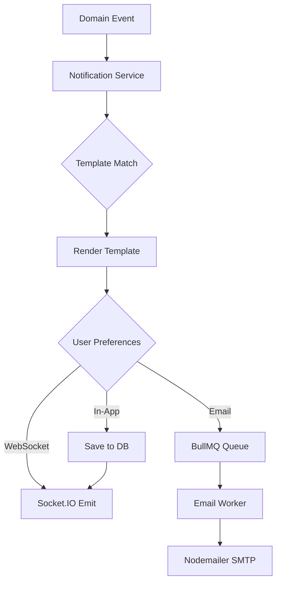

# Notification Architecture

## Channels

| Channel | Technology | Use Case |
|---------|-----------|----------|
| In-App | Database + WebSocket | Real-time UI notifications |
| Email | Nodemailer + BullMQ | Async digest and alerts |
| WebSocket | Socket.IO | Live dashboard updates |

## Notification Flow



## Event → Notification Mapping

| Event | Recipients | Channels | Template |
|-------|-----------|----------|----------|
| Task Created | Project members | In-App, WS | `task_created` |
| Task Assigned | Assignee | In-App, Email, WS | `task_assigned` |
| Task Updated | Watchers | In-App, WS | `task_updated` |
| Task Deleted | Project members | In-App | `task_deleted` |
| Task Transitioned | Role-based | In-App, Email, WS | `task_transitioned` |
| MR Raised | Reviewers | In-App, Email | `mr_raised` |
| Moved to QA | QA team | In-App, Email, WS | `moved_to_qa` |
| QA Passed | Assignee, TL | In-App, WS | `qa_passed` |
| QA Failed | Assignee, TL | In-App, Email, WS | `qa_failed` |
| Deployed | All stakeholders | In-App, Email | `deployment_completed` |
| Comment Added | Task participants | In-App, WS | `comment_added` |
| Worklog Started | TL (optional) | WS | `worklog_started` |
| Report Ready | Requester | In-App, Email | `report_ready` |
| Overdue Task | Assignee, TL | Email | `task_overdue` |

## Template System

Templates stored in database with variable interpolation:

```handlebars
Subject: [Htask] Task {{task.key}} assigned to you

Hi {{user.firstName}},

{{actor.name}} assigned task **{{task.title}}** ({{task.key}}) to you.

Priority: {{task.priority}}
Due Date: {{task.dueDate}}

[View Task]({{appUrl}}/tasks/{{task.id}})
```

### Template Configuration

```typescript
interface NotificationTemplate {
  id: string;
  event: string;              // task_assigned
  channel: 'email' | 'in_app';
  subject: string;            // Email subject (Handlebars)
  body: string;               // Template body (Handlebars)
  isActive: boolean;
  organizationId: string;     // Org-specific override
}
```

## User Preferences

```typescript
interface NotificationPreference {
  userId: string;
  event: string;
  channels: {
    inApp: boolean;
    email: boolean;
    websocket: boolean;
  };
  digest: 'instant' | 'hourly' | 'daily' | 'none';
}
```

## BullMQ Job Processing

```typescript
// Queue: notifications:email
{
  name: 'send-email',
  data: {
    to: 'user@example.com',
    templateId: 'task_assigned',
    variables: { task, user, actor },
  },
  opts: {
    attempts: 3,
    backoff: { type: 'exponential', delay: 5000 },
  },
}
```

## WebSocket Events

```typescript
// Server → Client
socket.to(`user:${userId}`).emit('notification:new', {
  id: 'uuid',
  type: 'task_assigned',
  title: 'Task HT-123 assigned to you',
  body: 'Authentication module refactor',
  link: '/tasks/uuid',
  createdAt: '2026-06-15T10:00:00Z',
});
```

## In-App Notification UI

- Bell icon with unread count badge
- Dropdown panel with recent notifications
- Mark as read / mark all as read
- Click navigates to related entity
- Real-time updates without page refresh

## Scheduled Notifications

| Job | Schedule | Action |
|-----|----------|--------|
| Overdue tasks | Daily 9 AM | Email assignees + TLs |
| Weekly digest | Monday 8 AM | Summary email to all users |
| Release reminder | 3 days before | Notify stakeholders |
| Idle task alert | Daily | Tasks in same state > 5 days |

## Rate Limiting

- Max 50 emails per user per hour
- Batch digest for high-frequency events
- Deduplication window: 5 minutes for same event+entity
