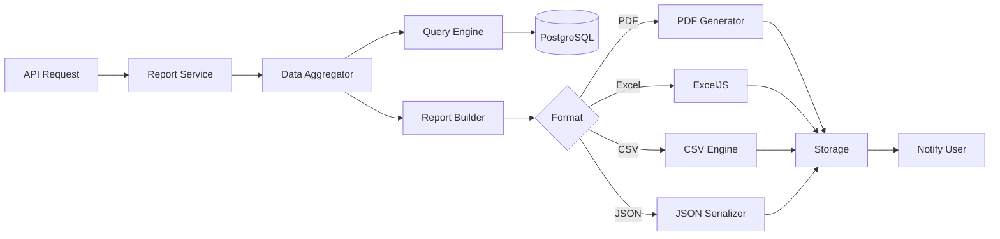

# Reporting Architecture

## Report Types

| Type | Period | Auto-Schedule | Sections |
|------|--------|---------------|----------|
| Daily | Previous day | 6 AM daily | Task summary, active worklogs |
| Weekly | Previous week | Monday 7 AM | Velocity, utilization, bugs |
| Monthly | Previous month | 1st of month | Trends, release progress, KPIs |
| Quarterly | Previous quarter | 1st of quarter | Strategic metrics, forecasts |
| Yearly | Previous year | Jan 1 | Annual review, team performance |
| Custom | User-defined | Manual | Configurable sections |

## Report Sections

| Section | Data Source | Charts |
|---------|-----------|--------|
| Task Summary | tasks | Status distribution pie |
| Team Utilization | worklogs | Bar chart by member |
| Developer Productivity | worklogs + tasks | Line chart over time |
| Module Completion | modules + tasks | Progress bars |
| Release Progress | releases + items | Gantt-style timeline |
| Bug Trends | tasks (type=BUG) | Trend line chart |
| QA Success Rate | tasks (QA states) | Pass/fail ratio |
| Lead Time | task histories | Histogram |
| Cycle Time | task histories | Box plot data |
| Velocity Trends | sprints + story points | Burndown chart |
| Workload Distribution | task_assignees | Heatmap |

## Generation Pipeline



## Export Formats

### PDF
- Puppeteer/HTML-to-PDF for rich layouts
- Company branding header/footer
- Charts rendered as images (Recharts server-side)
- Table of contents for long reports

### Excel (ExcelJS)
- Multiple worksheets per section
- Formatted headers, conditional formatting
- Charts embedded as images
- Pivot-table ready data sheets

### CSV
- Flat tabular export per section
- UTF-8 with BOM for Excel compatibility
- Configurable delimiter

### JSON
- Structured data for API consumers
- Full metadata and computed metrics
- Suitable for external integrations

## Report API

```typescript
// Generate report (async)
POST /reports/generate
{
  type: 'WEEKLY',
  format: 'PDF',
  projectId: 'uuid',          // optional, all projects if omitted
  dateRange: { from, to },
  sections: ['task_summary', 'team_utilization'],
  filters: { teamId, moduleId }
}
→ { reportId: 'uuid', status: 'processing' }

// Poll status
GET /reports/:id
→ { status: 'completed', downloadUrl: '/reports/:id/download' }

// Download
GET /reports/:id/download?format=pdf
```

## Scheduled Reports

```typescript
interface ReportSchedule {
  id: string;
  name: string;
  type: ReportType;
  format: ExportFormat;
  cron: string;               // '0 7 * * 1' (Monday 7 AM)
  projectId?: string;
  sections: string[];
  recipients: string[];       // User IDs or email addresses
  isActive: boolean;
}
```

Managed via BullMQ repeatable jobs.

## Analytics Dashboard (Real-time)

Separate from batch reports, dashboards query live data:

```typescript
GET /analytics/dashboard?scope=manager|team|personal
→ {
  activeUsers: 12,
  tasksInProgress: 45,
  qaQueue: 8,
  overdueTasks: 3,
  upcomingReleases: [...],
  currentActivity: [...]
}
```

### Dashboard Scopes

| Scope | Audience | Metrics |
|-------|----------|---------|
| Manager | Managers | Org-wide KPIs, all teams |
| Team | Team Leads | Team-specific metrics |
| Personal | All users | Own tasks, worklog, activity |

## Caching Strategy

- Dashboard metrics: Redis cache, 30-second TTL
- Report data: Computed on demand, cached 1 hour
- Historical reports: Stored in file storage, metadata in DB

## Frontend Charts (Recharts)

| Chart | Component | Data Endpoint |
|-------|-----------|---------------|
| Status Distribution | PieChart | `/analytics/task-distribution` |
| Productivity | AreaChart | `/analytics/productivity` |
| Utilization | BarChart | `/analytics/utilization` |
| Velocity | LineChart | `/analytics/velocity` |
| Bug Trends | ComposedChart | `/analytics/bug-trends` |
| Lead Time | BarChart | `/analytics/lead-time` |
